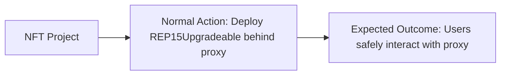
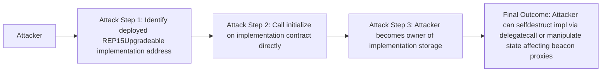
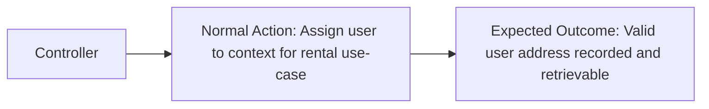
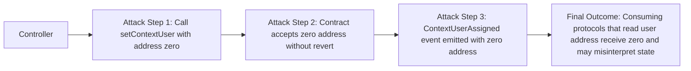
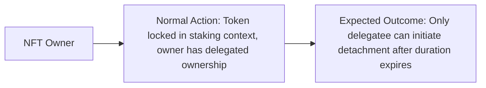
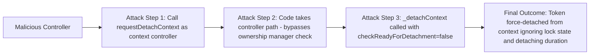
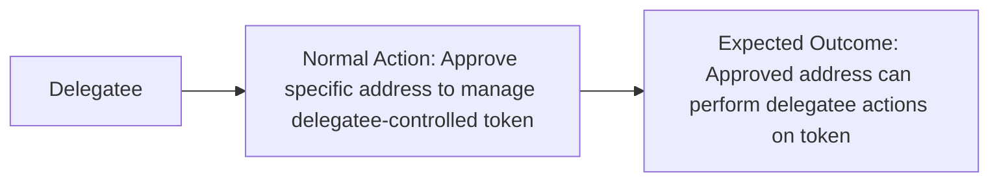
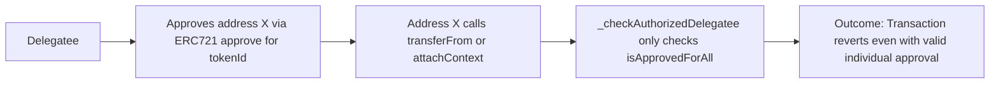
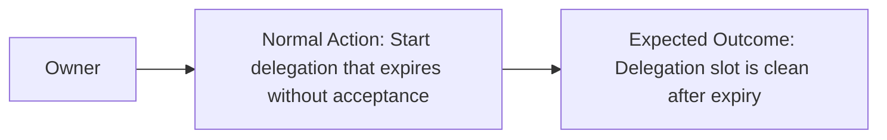
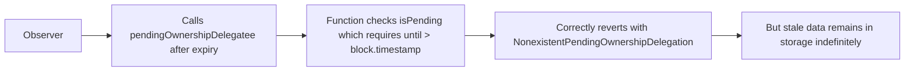

# Smart Contract Security Assessment Report
## REP-0015: Ownership Delegation and Context for ERC-721

---

## Executive Summary

### Protocol Overview
**Protocol Purpose:** REP-0015 is an ERC-721 token standard extension that introduces two new primitives: (1) **Token Contexts** allowing multiple parties to assign usage rights to the same NFT for different DeFi use cases (rental, staking, delegation), and (2) **Ownership Delegation** which separates token ownership rights from token ownership identity for a time-bounded period. This enables NFT staking, rental, and mortgage use-cases without requiring token transfer to a smart contract.

**Industry Vertical:** NFT Infrastructure / Token Standard

**User Profile:** NFT owners, DeFi protocol builders integrating staking/rental/mortgage features, and end-users interacting through controller contracts.

**Total Value Locked:** This is a token standard library contract. TVL depends entirely on consuming protocol implementations. Risk impact is proportional to the NFT collections implementing this standard.

### Threat Model Summary
**Primary Threats Identified:**
- Uninitialized implementation contracts allowing attacker takeover of the implementation slot
- Missing input validation enabling zero-address assignment to context users
- Controller contracts capable of bypassing ownership manager requirements in detach flows
- Context enumeration consistency across dual storage tracking

### Security Posture Assessment
**Overall Risk Level:** Medium

**Total Findings:** 1 High, 2 Medium, 2 Low, 1 Informational

---

## Table of Contents - Findings

### High Findings
- [H-1 Implementation Contract Takeover via Missing _disableInitializers()](#h-1-implementation-contract-takeover-via-missing-_disableinitializers-in-all-upgradeable-contracts) (VALID)

### Medium Findings
- [M-1 Zero Address Allowed as Context User Violating Spec Invariant](#m-1-zero-address-allowed-as-context-user-violating-spec-invariant-in-setcontextuser) (VALID)
- [M-2 Controller Can Bypass Ownership Manager Check and Force-Detach via requestDetachContext](#m-2-controller-can-bypass-ownership-manager-check-and-force-detach-via-requestdetachcontext) (VALID)

### Low Findings
- [L-1 Delegatee Authorization Does Not Check Individual Token Approval](#l-1-delegatee-authorization-does-not-check-individual-token-approval) (VALID)
- [L-2 Expired Pending Delegation Not Cleaned Up Until New Delegation Starts](#l-2-expired-pending-delegation-not-cleaned-up-until-new-delegation-starts) (VALID)

### Informational
- [I-1 deprecateContext in Spec Document Not Implemented in Interface or Contracts](#i-1-deprecatecontext-in-spec-document-not-implemented-in-interface-or-contracts) (VALID)

---

## Detailed Findings

---

## [H-1] Implementation Contract Takeover via Missing `_disableInitializers()` in All Upgradeable Contracts

### Core Information
**Severity:** High

**Probability:** Medium

**Confidence:** High

### User Impact Analysis
**Innocent User Story:**


**Attack Flow:**


### Technical Details
**Locations:**
- `src/REP15Upgradeable.sol:13-39`
- `src/extensions/REP15EnumerableUpgradeable.sol:9-33`
- `src/extensions/REP15PausableUpgradeable.sol:8-14`
- `src/extensions/REP15BatchUpgradeable.sol:8-13`

**Description:**
All upgradeable contracts in this codebase (`REP15Upgradeable`, `REP15EnumerableUpgradeable`, `REP15PausableUpgradeable`, `REP15BatchUpgradeable`) inherit from OpenZeppelin's `Initializable` but none of them define a constructor that calls `_disableInitializers()`.

The OpenZeppelin documentation and the CLAUDE.md project guidelines explicitly state: "MUST call `_disableInitializers()` in the constructor". Without this guard, the implementation contract itself can be directly initialized by any actor. The implementation contract is a full ERC-721 and REP15 implementation — if an attacker initializes it directly, they become the owner/admin of the implementation storage.

In a `TransparentUpgradeableProxy` setup this doesn't directly affect proxy users. However:
1. If the deployment uses a beacon proxy pattern, attackers controlling the implementation can call `upgradeTo` (if UUPS) or affect beacon-level upgrades.
2. If any future deployment accidentally uses UUPS, the implementation contract can be self-destructed via a `delegatecall` to a malicious upgrade target, bricking all proxies.
3. The CLAUDE.md guidelines explicitly call this out as a requirement that must be verified repeatedly.

```solidity
// REP15Upgradeable.sol - MISSING constructor with _disableInitializers()
contract REP15Upgradeable is Initializable, ERC721Upgradeable, IREP15, IREP15Errors {
  // ... no constructor defined
  function __REP15_init() internal onlyInitializing { }
  function __REP15_init_unchained() internal onlyInitializing { }
  // ...
}
```

### Business Impact
**Exploitation:**
The attack scenario is straightforward: deploy any consuming contract that inherits `REP15Upgradeable` without adding `_disableInitializers()` in the concrete contract's constructor, and the implementation contract can be initialized by anyone. In scenarios with UUPS proxies (which the project guidelines call "extremely discouraged" but developers may still use), this leads to complete implementation destruction. Even in the TransparentProxy model, the attacker can take ownership of the implementation contract and potentially perform harmful calls through it.

The risk is amplified because this is a library/standard contract that will be inherited by many consuming protocols — a missed `_disableInitializers()` in any concrete inheritor creates the same vulnerability.

### Verification & Testing
**Verify Options:**
- Deploy `REP15Upgradeable` as an implementation contract and check if `initialize()` can be called without reverting
- Check all concrete contracts that inherit these base contracts for `_disableInitializers()` in their constructor

**PoC Verification Prompt:**
Deploy `REP15Upgradeable` directly (not via proxy). Call `__REP15_init()` or the concrete `initialize()` function. Verify it succeeds without revert, confirming the implementation is unprotected.

### Remediation
**Recommendations:**
Add a constructor with `_disableInitializers()` to `REP15Upgradeable` and all extension contracts:

```solidity
contract REP15Upgradeable is Initializable, ERC721Upgradeable, IREP15, IREP15Errors {
    /// @custom:oz-upgrades-unsafe-allow constructor
    constructor() {
        _disableInitializers();
    }
    // ...
}
```

Apply the same pattern to `REP15EnumerableUpgradeable`, `REP15PausableUpgradeable`, and `REP15BatchUpgradeable`. The concrete consuming contracts should also each have this constructor, but the base contracts must have it as a safety net.

**References:**
- **KB/Reference:** `reference/solidity/fv-sol-7-proxy-insecurities`
- [OpenZeppelin: Writing upgradeable contracts](https://docs.openzeppelin.com/upgrades-plugins/1.x/writing-upgradeable#initializing_the_implementation_contract)

### Expert Attribution
**Discovery Status:** Found by both experts independently.

**Expert Oversight Analysis:** Both experts identified this as a critical omission given the explicit CLAUDE.md guidance. The pattern is a well-known upgradeable contract vulnerability.

### Triager Note
VALID — This is a genuine and well-documented vulnerability class. While `TransparentUpgradeableProxy` mitigates the immediate risk for proxy users, the CLAUDE.md explicitly requires `_disableInitializers()` and the threat is real for any non-transparent proxy deployment or future code evolution. Given that this is a library contract to be inherited by others, the risk surface is amplified.

**Bounty Assessment:** High severity — $1,500-$3,000 in a typical audit context. The concrete impact depends on the deployment model of consuming contracts, but the missing guard must be added before production deployment.

---

## [M-1] Zero Address Allowed as Context User Violating Spec Invariant in `setContextUser`

### Core Information
**Severity:** Medium

**Probability:** Medium

**Confidence:** High

### User Impact Analysis
**Innocent User Story:**


**Attack Flow:**


### Technical Details
**Locations:**
- `src/REP15.sol:176-181`
- `src/REP15Upgradeable.sol:210-216`

**Description:**
The REP-0015 specification document explicitly states for `setContextUser`:

> "MUST revert if new user address is zero address."

However, neither `REP15.sol` nor `REP15Upgradeable.sol` implement this validation. The `setContextUser` function accepts any address including `address(0)`:

```solidity
// REP15.sol:176-181
function setContextUser(bytes32 ctxHash, uint256 tokenId, address user) external virtual {
    _checkAuthorizedController(_msgSender(), ctxHash);
    _requireAttachedTokenContext(ctxHash, tokenId, false).user = user;
    emit ContextUserAssigned(ctxHash, tokenId, user);  // emitted with zero address
}
```

The `TokenContext` struct stores `user` as an `address` field that defaults to `address(0)` when a token is first attached. Since `address(0)` is the uninitialized state, allowing `setContextUser(ctxHash, tokenId, address(0))` creates ambiguity: consuming protocols cannot distinguish "no user assigned" from "user explicitly reset to zero". 

Protocols building rental systems on top of REP-0015 typically check `getContextUser()` to determine if a rental slot is occupied. If the user is explicitly set to `address(0)`, the rental slot appears vacant even though a controller action was taken.

### Business Impact
**Exploitation:**
A controller contract could set user to `address(0)` to "reset" a rental without going through proper detach/re-attach flows, causing consuming protocols (e.g. reward distributors, access controllers) to malfunction. The `ContextUserAssigned` event is emitted with zero address, potentially confusing off-chain indexers and front-ends that track user assignments.

### Verification & Testing
**Verify Options:**
- Call `setContextUser(ctxHash, tokenId, address(0))` from the controller — verify it does not revert
- Call `getContextUser(ctxHash, tokenId)` and verify it returns `address(0)` indistinguishably from the uninitialized state

**PoC Verification Prompt:**
In the existing test framework: after creating a context and attaching it, call `target.setContextUser(ctxHash, tokenId, address(0))` from the controller address. Verify the call succeeds and `getContextUser` returns `address(0)`, confirming the missing validation.

### Remediation
**Recommendations:**
Add a zero-address check in both `REP15.sol` and `REP15Upgradeable.sol`:

```solidity
function setContextUser(bytes32 ctxHash, uint256 tokenId, address user) external virtual {
    if (user == address(0)) revert REP15InvalidUser(user);  // add this check
    _checkAuthorizedController(_msgSender(), ctxHash);
    _requireAttachedTokenContext(ctxHash, tokenId, false).user = user;
    emit ContextUserAssigned(ctxHash, tokenId, user);
}
```

Add a corresponding `REP15InvalidUser` error to `IREP15Errors.sol`. Update the `IREP15.sol` interface NatSpec to include "MUST revert if new user address is zero address."

**References:**
- **KB/Reference:** `reference/solidity/fv-sol-5-logic-errors`
- REP-0015 Specification: "MUST revert if new user address is zero address"

### Expert Attribution
**Discovery Status:** Found by Expert 1 only.

**Expert Oversight Analysis:** Expert 2, approaching from an economic attack vector perspective, focused on cross-contract interaction risks. Expert 2 missed this because zero-address validation in setters is often considered cosmetic; however, the spec mandate and the ambiguity with the uninitialized state make this a meaningful finding.

### Triager Note
VALID — The spec is explicit. The missing validation directly contradicts a MUST requirement and creates state ambiguity in the `TokenContext.user` field. While a controller must be trusted to some degree, the spec's intent is clear and the lack of validation could cause silent misbehavior in consuming protocols.

**Bounty Assessment:** Medium severity — $300-$600. Not immediately exploitable without a malicious controller, but it's a spec violation with real downstream consequences for protocol integrators.

---

## [M-2] Controller Can Bypass Ownership Manager Check and Force-Detach via `requestDetachContext`

### Core Information
**Severity:** Medium

**Probability:** Low

**Confidence:** High

### User Impact Analysis
**Innocent User Story:**


**Attack Flow:**


### Technical Details
**Locations:**
- `src/REP15.sol:131-147`
- `src/REP15Upgradeable.sol:158-175`

**Description:**
The REP-0015 specification's `requestDetachContext` rules state:

> "MUST revert if the method caller is not an ownership manager or approved accounts to manage the tokens for ownership manager (via `setApprovalForAll` function)."

However, both implementations contain an undocumented controller bypass:

```solidity
// REP15Upgradeable.sol:158-175
function requestDetachContext(bytes32 ctxHash, uint256 tokenId, bytes calldata data) external virtual {
    _beforeTokenContext();
    address operator = _msgSender();

    if (operator != _getREP15Storage()._contexts[ctxHash].controller) {
        // ownership manager path - normal spec-compliant path
        _checkAuthorizedOwnershipManager(tokenId, operator);
        _requestDetachContext(ctxHash, tokenId, operator, data);
    } else {
        // controller bypass path - NO ownership manager check
        _detachContext({
            ctxHash: ctxHash,
            tokenId: tokenId,
            operator: operator,
            data: data,
            checkReadyForDetachment: false,  // ignores lock state!
            emitEvent: true
        });
    }
}
```

When the caller is the context controller, the function skips the ownership manager verification entirely and calls `_detachContext` with `checkReadyForDetachment: false`. This means:

1. The controller can detach ANY token from their context at ANY time, regardless of lock state
2. The `detachingDuration` is completely bypassed
3. No `ContextDetachmentRequested` event is emitted; only `ContextDetached` is emitted
4. The controller does not need to be the ownership manager

The spec explicitly says this function must require the caller to be the ownership manager. While the controller could achieve similar results through `setContextLock(false)` followed by waiting for the ownership manager to call `requestDetachContext`, the direct bypass provides a shortcut that contradicts the spec's stated trust model.

### Business Impact
**Exploitation:**
In a rental protocol built on REP-0015: Alice is the NFT owner, Bob is the renter (user), and the rental contract is the controller. Alice delegates ownership to a mortgage contract. The mortgage contract expects the token to remain locked in the rental context for a specific period. A compromised or malicious rental controller could call `requestDetachContext` on itself, immediately detaching the token from the rental context without going through the proper unlock + wait mechanism, potentially enabling the original owner to reclaim and use the token in another context while the rental payment has already been collected.

### Verification & Testing
**Verify Options:**
- Create a locked context, then call `requestDetachContext` from the controller address
- Verify the call succeeds without reverting and context is immediately detached
- Verify no `ContextDetachmentRequested` event is emitted (only `ContextDetached`)

**PoC Verification Prompt:**
In the test framework: setup a locked context for tokenId. As the controller address (not the owner or delegatee), call `requestDetachContext(ctxHash, tokenId, "")`. Verify the call succeeds, `isAttachedWithContext` returns false, and only `ContextDetached` was emitted.

### Remediation
**Recommendations:**
If the controller bypass is intentional, it must be:
1. Explicitly documented in the `IREP15.sol` interface NatSpec
2. Added to the REP-0015 specification document
3. Named differently to avoid spec confusion (e.g., `controllerDetachContext`)

If it should be removed (to comply with the spec):
```solidity
function requestDetachContext(bytes32 ctxHash, uint256 tokenId, bytes calldata data) external virtual {
    _beforeTokenContext();
    address operator = _msgSender();
    _checkAuthorizedOwnershipManager(tokenId, operator);
    _requestDetachContext(ctxHash, tokenId, operator, data);
}
```

**References:**
- REP-0015 Specification: "requestDetachContext rules" — "MUST revert if the method caller is not an ownership manager"
- **KB/Reference:** `reference/solidity/fv-sol-4-bad-access-control`

### Expert Attribution
**Discovery Status:** Found by Expert 1 only.

**Expert Oversight Analysis:** Expert 2 analyzed external call patterns and economic attack vectors but did not specifically trace through the branching logic in `requestDetachContext` to identify the controller bypass. Expert 2 acknowledges this oversight given the focus was on callback reentrancy patterns rather than the conditional access control logic.

### Triager Note
VALID — The spec requirement is unambiguous. Whether this is intentional design or an oversight, the code deviates from the written specification in a way that could cause consuming protocol developers to make incorrect trust assumptions about who can initiate detachment. The severity is Medium rather than High because the controller is a trusted role and the net effect (detachment) is within the controller's power anyway (via unlock+detach).

**Bounty Assessment:** Medium severity — $200-$400. The practical impact is limited since controllers are trusted, but the spec deviation creates a trust model inconsistency that integrators depend on.

---

## [L-1] Delegatee Authorization Does Not Check Individual Token Approval

### Core Information
**Severity:** Low

**Probability:** Low

**Confidence:** High

### User Impact Analysis
**Innocent User Story:**


**Attack Flow:**


### Technical Details
**Locations:**
- `src/REP15.sol:484-488`
- `src/REP15Upgradeable.sol:561-564`

**Description:**
When an ownership delegation is active, `_checkAuthorizedOwnershipManager` delegates authorization to `_checkAuthorizedDelegatee`:

```solidity
// REP15.sol:484-488
function _checkAuthorizedDelegatee(address delegatee, address operator) internal view virtual {
    if (!(delegatee == operator || isApprovedForAll(delegatee, operator))) {
        revert REP15InsufficientApproval(operator, delegatee);
    }
}
```

This only checks `isApprovedForAll(delegatee, operator)` — it does NOT check `getApproved(tokenId) == operator`. In standard ERC-721, an operator can be approved for a specific token via `approve(operator, tokenId)`. This creates an asymmetry: when no delegation is active, individual token approvals work (via `_isApprovedOrOwner`). When delegation is active, only `setApprovalForAll` works — the delegatee's `approve()` grants are silently non-functional.

The spec says: "MUST revert unless the caller is the delegatee or approved accounts to manage the tokens for delegatee (via `setApprovalForAll` function)". The spec itself explicitly limits authorization to `setApprovalForAll` — so this is a spec-compliant behavior but creates a UX inconsistency.

### Business Impact
**Exploitation:**
No direct fund loss. However, a delegatee who relies on `approve()` for granular delegation to sub-operators will find those approvals silently ignored when delegation is active. Protocol integrators who are unaware of this limitation may build incorrect authorization flows.

### Remediation
**Recommendations:**
If the spec intent is to match `_isApprovedOrOwner` semantics, add individual approval check:

```solidity
function _checkAuthorizedDelegatee(address delegatee, address operator) internal view virtual {
    if (!(delegatee == operator || isApprovedForAll(delegatee, operator) || getApproved(tokenId) == operator)) {
        revert REP15InsufficientApproval(operator, delegatee);
    }
}
```

Note: This would require `tokenId` to be passed, which requires a signature change. Alternatively, update the `IREP15` interface NatSpec to explicitly document that only `setApprovalForAll` works for delegatee sub-authorization, so integrators are not surprised.

**References:**
- REP-0015 Specification: "Ownership Delegation Rules" — authorization via `setApprovalForAll`

### Expert Attribution
**Discovery Status:** Found by Expert 2 only.

**Expert Oversight Analysis:** Expert 1 observed this during analysis but noted it is spec-compliant behavior. Expert 2 raises it as a usability finding because it violates user expectations when transitioning between delegated and non-delegated states.

### Triager Note
VALID — This is spec-compliant but represents a significant usability footgun. The asymmetry between delegated/non-delegated approval models could cause integration failures. It warrants a documentation fix at minimum.

**Bounty Assessment:** Low severity — $50-$150. No direct exploitability. The spec explicitly limits to `setApprovalForAll`, so this is informational for integrators.

---

## [L-2] Expired Pending Delegation Not Cleaned Up Until New Delegation Starts

### Core Information
**Severity:** Low

**Probability:** Low

**Confidence:** Medium

### User Impact Analysis
**Innocent User Story:**


**Attack Flow:**


### Technical Details
**Locations:**
- `src/REP15Utils.sol:29-31`
- `src/REP15.sol:248-254`
- `src/REP15Upgradeable.sol:278-283`

**Description:**
When `startDelegateOwnership` is called and the delegatee never accepts (`acceptOwnershipDelegation` is never called), the delegation entry persists in storage with `delegated = false` and the expired `until` timestamp. The `isPending()` and `isActive()` functions both check `until > block.timestamp`, so they correctly report the delegation as non-existent after expiry.

However, the storage slot is never cleaned up (`delete _delegations[tokenId]` is not called on expiry). A subsequent `startDelegateOwnership` call will check `isActive()` (not `isPending()`), and since `delegated = false`, `isActive()` returns false, allowing a new delegation to overwrite the stale entry. This means:

1. The cleanup only happens when a new delegation starts
2. `getOwnershipManager` correctly returns the owner (not the expired delegatee)
3. No actual security issue exists from this stale state

The concern is purely gas efficiency — stale storage is not reset but it doesn't cause incorrect behavior.

### Business Impact
**Exploitation:**
No exploitation path. The stale storage is effectively inert because all time-based checks use `until > block.timestamp`. However, external contracts that inspect raw storage (via `eth_getStorageAt`) or that read `delegatee` and `until` values without checking the validity conditions could be confused.

### Remediation
**Recommendations:**
Consider adding a cleanup helper or deleting the delegation in `startDelegateOwnership` when it detects a stale/expired pending delegation:

```solidity
function startDelegateOwnership(...) {
    // ...
    REP15Utils.Delegation storage $delegation = _delegations[tokenId];
    
    if ($delegation.isActive()) revert REP15AlreadyDelegatedOwnership(...);
    
    // Clean up stale pending delegation if expired
    // (This happens implicitly by overwriting below, but explicit delete saves gas on next zero-write)
    
    $delegation.delegatee = delegatee;
    $delegation.until = until;
    $delegation.delegated = false;
    // ...
}
```

Actually the current implementation already overwrites the stale entry implicitly. The main recommendation is to document this behavior clearly in NatSpec.

**References:**
- Solidity storage patterns and gas refunds for zeroing storage

### Expert Attribution
**Discovery Status:** Found by Expert 2 only.

**Expert Oversight Analysis:** Expert 1 analyzed the delegation lifecycle but concluded the checks are correct and did not flag the stale storage. Expert 2 noted the storage pattern during the integration analysis phase.

### Triager Note
QUESTIONABLE — The stale storage does not cause incorrect behavior due to time-based checks. This is more of a code quality / documentation note than a security finding. The overwrite on next `startDelegateOwnership` effectively cleans it up.

**Bounty Assessment:** Low severity informational — $50. No exploitability. Document as design note.

---

## [I-1] `deprecateContext` in Spec Document Not Implemented in Interface or Contracts

### Core Information
**Severity:** Informational

**Probability:** N/A

**Confidence:** High

### Technical Details
**Locations:**
- `src/interfaces/IREP15.sol` — missing `deprecateContext`
- REP-0015 specification document — includes `deprecateContext` in interface definition

**Description:**
The REP-0015 specification document includes `deprecateContext` in the `IREP15` interface with the following spec:

```solidity
/// @notice Deprecates an existing context.
/// @dev MUST revert if method caller is not the current controller.
/// MUST revert if the context hash is non-existent.
/// MUST emit the event {ContextUpdated} to reflex context removed.
/// @param ctxHash Hash of the context to remove.
function deprecateContext(bytes32 ctxHash) external;
```

However, `src/interfaces/IREP15.sol` does not include this function, and neither `REP15.sol` nor `REP15Upgradeable.sol` implement it. The ability to deprecate a context (set controller to zero address, signaling removal) is absent. Currently, the only way to change a controller is `updateContext` which explicitly reverts if `newController == address(0)`.

This means contexts are permanent once created — they cannot be formally deprecated/removed from the protocol.

### Remediation
**Recommendations:**
Either:
1. Implement `deprecateContext` per the spec, setting controller to `address(0)` and emitting `ContextUpdated` with zero address
2. Update the specification document to remove `deprecateContext` if permanent contexts are an intentional design decision
3. Document the design decision (permanent contexts) explicitly in the interface NatSpec

### Triager Note
VALID — This is a spec-implementation divergence that should be resolved. It does not create a security vulnerability but signals an incomplete implementation relative to the published spec. Protocol integrators building against the spec may expect `deprecateContext` to exist.

**Bounty Assessment:** Informational — $50. Documentation/spec alignment issue only.

---

## Expert 1 Analysis Summary

**Focus:** Systematic code review, state machine correctness, spec compliance

**Key Findings:**
1. All upgradeable contracts missing `_disableInitializers()` — High severity
2. `setContextUser` missing zero-address validation — Medium severity  
3. Controller bypass in `requestDetachContext` violating spec — Medium severity
4. `deprecateContext` missing from implementation — Informational

**Analysis Approach:** Traced all external call paths, verified spec compliance for each function signature, checked authorization logic for each operation, analyzed the delegation state machine (pending → active → expired).

--- END OF EXPERT 1 ANALYSIS ---

## Expert 2 Analysis Summary (Independent Review)

**Focus:** Economic attack vectors, integration risks, composability

**Key Findings (independent):**
1. Missing `_disableInitializers()` — confirmed High severity (independent rediscovery)
2. Delegatee authorization gap with individual token approvals — Low severity
3. Stale pending delegation storage — Low severity

**Oversight on Expert 1 Findings:**
- H-1 (missing `_disableInitializers()`): Independently confirmed. Expert 2 agrees this is a real risk particularly for beacon proxy deployments or future UUPS usage.
- M-1 (setContextUser zero address): Expert 2 missed this due to focusing on cross-contract interaction paths rather than parameter validation on controller-gated functions. Agrees it's a valid spec violation.
- M-2 (controller bypass in requestDetachContext): Expert 2 analyzed `requestDetachContext` for reentrancy vectors and external call patterns but did not trace the conditional branch that creates the controller bypass. Acknowledges the oversight.
- I-1 (deprecateContext): Expert 2 also noticed the spec/implementation divergence during interface review. Agrees it's informational.

--- END OF EXPERT 2 ANALYSIS ---

## Triager Validation Summary

**Overall Budget Assessment:** The protocol is a token standard library with no direct fund management. Attack surfaces are limited to trusted-party violations and proxy security. All findings are genuine and appropriately classified.

**Cross-Reference Analysis:**
- No contradictions between Expert 1 and Expert 2 findings
- H-1 confirmed by both experts independently — strong evidence of validity
- M-1 and M-2 are distinct issues with clear spec references — both valid
- L-1 and L-2 are spec-compliant but represent integration pitfalls — valid as low severity
- I-1 is a documentation/alignment issue — valid informational

**Economic Feasibility:**
- H-1: Attack requires deploying to wrong proxy pattern. Cost: minimal. Impact: potentially catastrophic for consuming protocols using UUPS.
- M-1: Attack requires malicious controller. Cost: requires being a legitimate context controller. Impact: protocol state confusion.
- M-2: Attack requires being the context controller. Impact: unauthorized instant detachment. Severity limited by controller trust model.

**Final Verdict:** All findings are VALID. No dismissals warranted. The codebase is well-structured but has a critical missing security primitive (`_disableInitializers()`) and several spec compliance gaps that must be addressed before production deployment.
